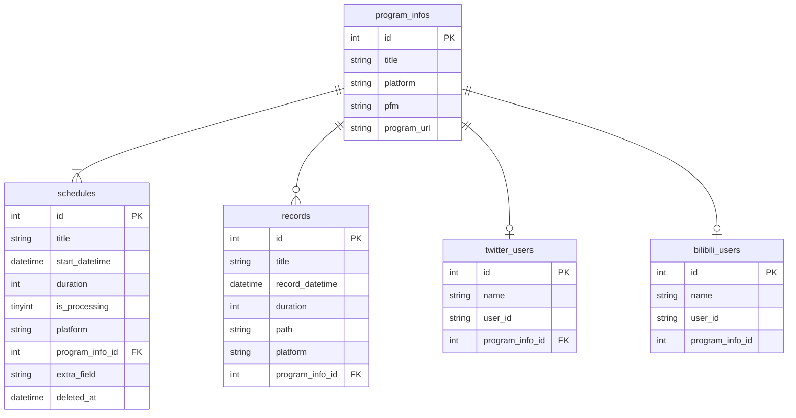

# Database

## ER図

```mermaid
erDiagram
schedules {
	int id PK
	string title
	datetime start_datetime
	int duration
	tinyint is_processing
	string platform
	int program_info_id FK
	string extra_field
    datetime deleted_at
}

records {
	int id PK
	string title
	datetime record_datetime
	int duration
	string path
	string platform
	int program_info_id FK
}

program_infos {
	int id PK
	string title
	string platform
	string pfm
	string program_url
}

twitter_users {
	int id PK
	string name
	string user_id
	int program_info_id FK
}

bilibili_users {
    int id PK
    string name
    string user_id
    int program_info_id
}


program_infos ||--|{ schedules: ""
program_infos ||--o{ records: ""
program_infos ||--o| twitter_users: ""
program_infos ||--o| bilibili_users: ""
```