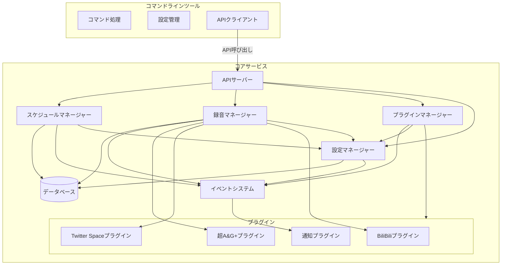
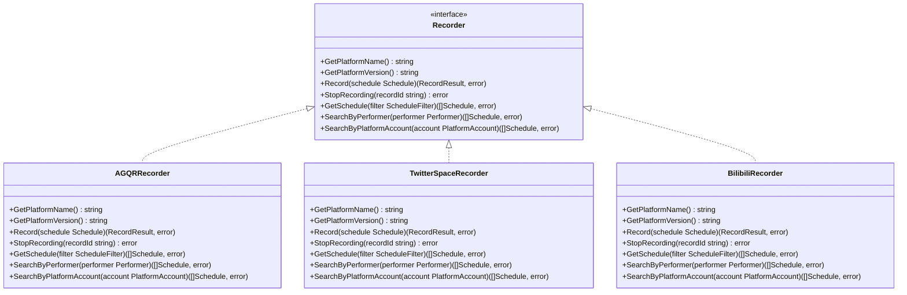
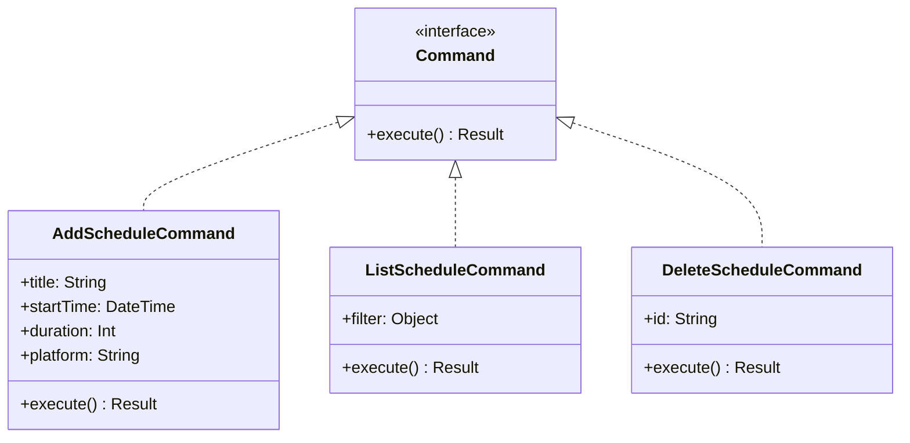
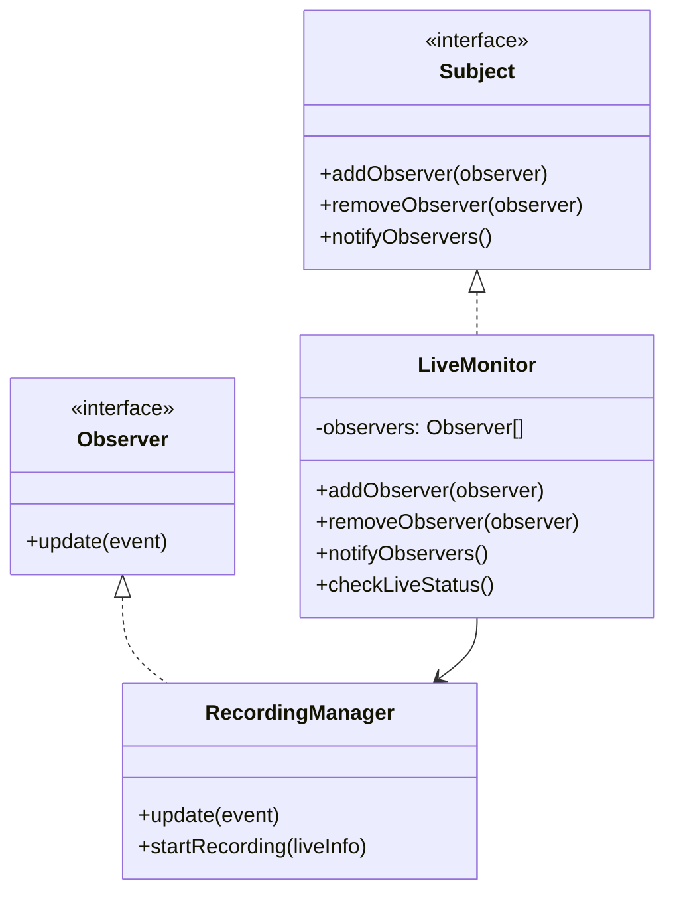
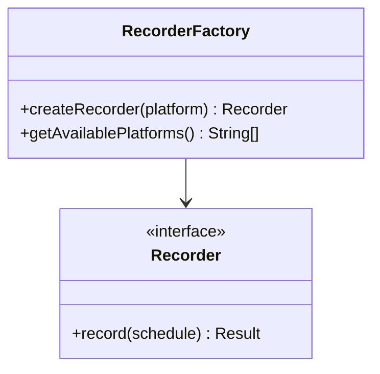
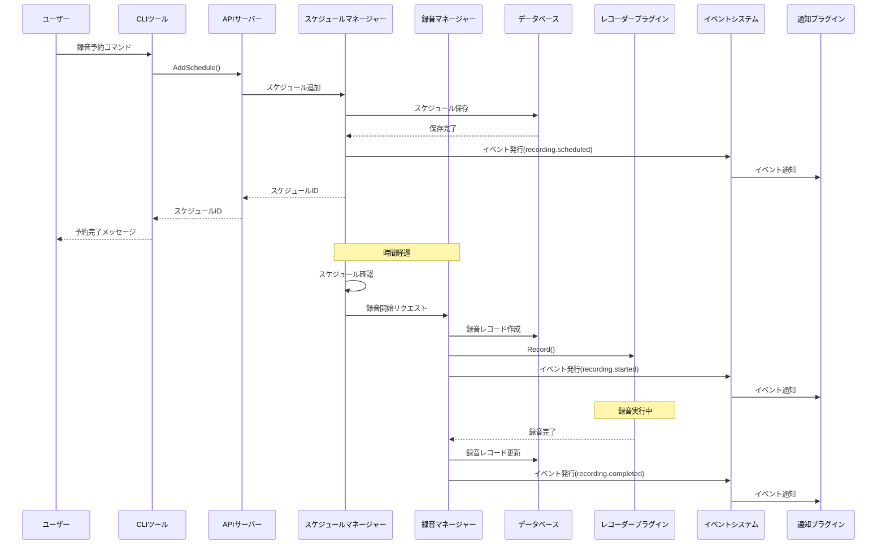
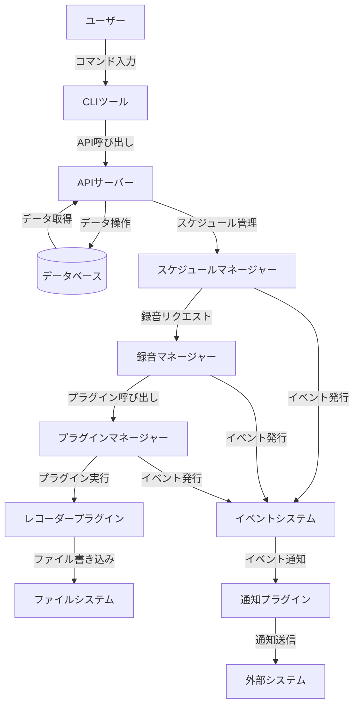
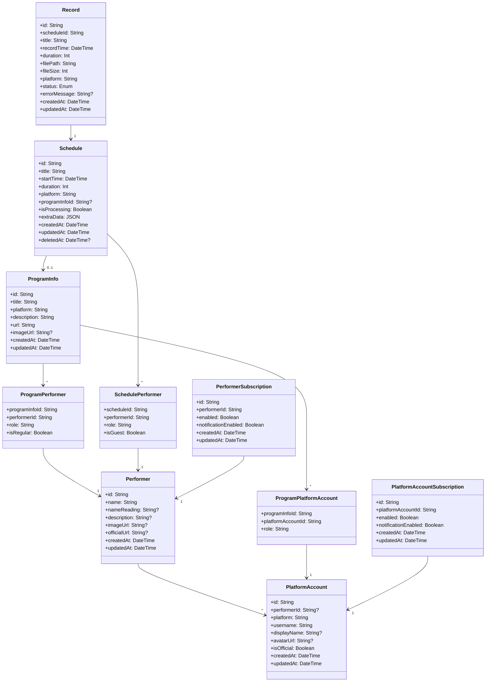
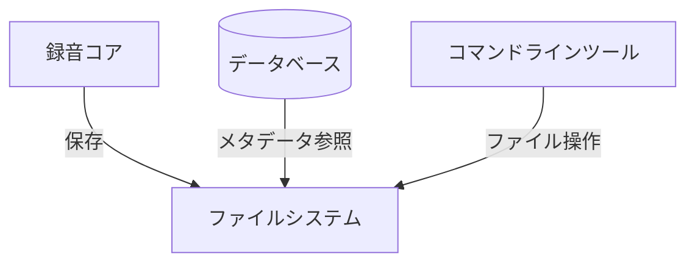
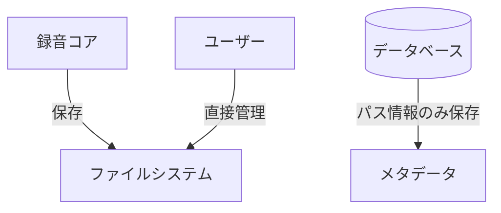

# システムパターン：Rec-adio

## システムアーキテクチャ

Rec-adioのv4では、「dockerd+docker」のような関係性を持つクライアント・サーバーアーキテクチャを採用します。このアーキテクチャは、以下の主要コンポーネントで構成されます：



### 主要コンポーネント

1. **コアサービス（デーモン）**：
   - システムの中心となるバックグラウンドプロセス
   - 常時動作し、スケジュールの管理や録音処理を担当
   - プラグインを通じて各プラットフォームとの連携を実現
   - APIを通じてクライアントからの要求を処理

2. **コマンドラインツール**：
   - ユーザーインターフェースを提供
   - コアサービスとAPIを通じて通信
   - 録音予約、スケジュール管理、設定変更などの操作を提供

3. **プラグインシステム**：
   - 各プラットフォーム向けの録音機能を提供
   - 標準化されたインターフェースを通じてコアと連携
   - 動的に読み込み可能な設計

4. **データベース**：
   - スケジュール、録音記録、設定などのデータを保存
   - 軽量な組み込みデータベースを使用（SQLite/BoltDBなど）

5. **APIサーバー**：
   - コアサービスとクライアント間の通信を担当
   - RESTful APIまたはgRPCを使用
   - 認証・認可機能を提供（オプション）

## 設計パターン

Rec-adioの実装には、以下の設計パターンを採用します：

## コアサービスとCLIツール間のインターフェース

コアサービスとCLIツール間の通信は、以下のインターフェースを通じて行われます：

```go
// CoreServiceAPI はコアサービスが公開するAPIを定義します
type CoreServiceAPI interface {
    // スケジュール関連
    AddSchedule(schedule Schedule) (string, error)
    GetSchedule(id string) (Schedule, error)
    ListSchedules(filter ScheduleFilter) ([]Schedule, error)
    DeleteSchedule(id string) error
    
    // 録音関連
    StartRecording(scheduleId string) error
    StopRecording(recordId string) error
    GetRecordStatus(recordId string) (RecordStatus, error)
    ListRecords(filter RecordFilter) ([]Record, error)
    
    // プラグイン関連
    ListPlugins() ([]PluginInfo, error)
    EnablePlugin(name string) error
    DisablePlugin(name string) error
    
    // 演者関連
    AddPerformer(performer Performer) (string, error)
    GetPerformer(id string) (Performer, error)
    ListPerformers(filter PerformerFilter) ([]Performer, error)
    DeletePerformer(id string) error
    
    // プラットフォームアカウント関連
    AddPlatformAccount(account PlatformAccount) (string, error)
    GetPlatformAccount(id string) (PlatformAccount, error)
    ListPlatformAccounts(filter PlatformAccountFilter) ([]PlatformAccount, error)
    DeletePlatformAccount(id string) error
    
    // 購読関連
    SubscribeToPerformer(performerId string, options SubscriptionOptions) error
    SubscribeToPlatformAccount(accountId string, options SubscriptionOptions) error
    ListSubscriptions(filter SubscriptionFilter) ([]Subscription, error)
    
    // 設定関連
    GetConfig(section string, key string) (interface{}, error)
    SetConfig(section string, key string, value interface{}) error
    ListConfig(section string) (map[string]interface{}, error)
    ResetConfig(section string, key string) error
    ExportConfig() ([]byte, error)
    ImportConfig(configData []byte) error
    
    // プラグイン設定関連
    GetPluginConfig(pluginName string, key string) (interface{}, error)
    SetPluginConfig(pluginName string, key string, value interface{}) error
    ListPluginConfig(pluginName string) (map[string]interface{}, error)
    ResetPluginConfig(pluginName string, key string) error
    
    // システム関連
    GetStatus() (SystemStatus, error)
    Shutdown() error
}
```

## 設計パターン

Rec-adioの実装には、以下の設計パターンを採用します：

### 1. プラグインパターン

各プラットフォーム向けのレコーダーは、プラグインとして実装します。これにより、コアシステムを変更することなく、新しいプラットフォームのサポートを追加できます。



### 1.1 プラグインAPI設計

v4のプラグインAPIは、以下の方針に基づいて設計します：

1. **レコーダープラグイン**：組み込み型のみをサポート
2. **通知プラグイン**：組み込み型と外部プラグインの両方をサポート
3. **イベントシステム**：プラグイン間の連携を実現

#### レコーダープラグインAPI

レコーダープラグインは、組み込み型のみをサポートし、コアシステムに直接統合します：

```go
// RecorderPlugin はレコーダープラグインのインターフェースです
type RecorderPlugin interface {
    // GetPlatformInfo はサポートするプラットフォームの情報を返します
    GetPlatformInfo() PlatformInfo
    
    // Record は指定されたスケジュールに基づいて録音を開始します
    Record(ctx context.Context, schedule Schedule) (RecordingSession, error)
    
    // GetSchedule はプラットフォームから番組スケジュールを取得します
    GetSchedule(ctx context.Context, filter ScheduleFilter) ([]Schedule, error)
    
    // SearchByPerformer は演者に基づいて番組を検索します
    SearchByPerformer(ctx context.Context, performer Performer) ([]Schedule, error)
    
    // SearchByPlatformAccount はプラットフォームアカウントに基づいて配信を検索します
    SearchByPlatformAccount(ctx context.Context, account PlatformAccount) ([]Schedule, error)
    
    // Initialize はプラグインの初期化を行います
    Initialize(ctx context.Context, config Config) error
    
    // Shutdown はプラグインのシャットダウン処理を行います
    Shutdown(ctx context.Context) error
}

// PlatformInfo はプラットフォームの情報を表す構造体です
type PlatformInfo struct {
    // ID はプラットフォームの一意な識別子です
    ID string
    
    // Name はプラットフォームの表示名です
    Name string
    
    // Version はプラットフォームのバージョンです
    Version string
    
    // URL はプラットフォームのウェブサイトURLです
    URL string
    
    // Features はプラットフォームがサポートする機能のリストです
    Features []string
    
    // ScheduleSupport はスケジュール取得をサポートするかどうかを示します
    ScheduleSupport bool
    
    // LiveDetectionSupport はライブ配信検出をサポートするかどうかを示します
    LiveDetectionSupport bool
    
    // PerformerSearchSupport は演者検索をサポートするかどうかを示します
    PerformerSearchSupport bool
    
    // AccountSearchSupport はアカウント検索をサポートするかどうかを示します
    AccountSearchSupport bool
}

// RecordingSession は録音セッションを表すインターフェースです
type RecordingSession interface {
    // GetID は録音セッションのIDを返します
    GetID() string
    
    // GetStatus は録音の現在のステータスを返します
    GetStatus() RecordingStatus
    
    // Stop は録音を停止します
    Stop(ctx context.Context) error
    
    // GetOutputPath は録音ファイルのパスを返します（完了後）
    GetOutputPath() string
    
    // GetMetadata は録音のメタデータを返します
    GetMetadata() map[string]interface{}
    
    // OnStatusChange はステータス変更時のコールバックを設定します
    OnStatusChange(callback func(status RecordingStatus))
}
```

#### イベントシステムAPI

イベントシステムは、将来的な外部プラグイン対応を見据えた設計にします：

```go
// Event はシステムイベントを表す構造体です
type Event struct {
    // Type はイベントのタイプです（例: "recording.started"）
    Type string `json:"type"`
    
    // Timestamp はイベントの発生時刻です
    Timestamp time.Time `json:"timestamp"`
    
    // Data はイベントのデータです
    Data map[string]interface{} `json:"data"`
}

// EventListener はイベントリスナーのインターフェースです
type EventListener interface {
    // OnEvent はイベント発生時に呼び出されるメソッドです
    OnEvent(event Event) error
    
    // GetSupportedEvents はリスナーがサポートするイベントタイプのリストを返します
    GetSupportedEvents() []string
}

// EventEmitter はイベントエミッターのインターフェースです
type EventEmitter interface {
    // AddListener はイベントリスナーを追加します
    AddListener(listener EventListener) error
    
    // RemoveListener はイベントリスナーを削除します
    RemoveListener(listener EventListener) error
    
    // EmitEvent はイベントを発行します
    EmitEvent(event Event) error
}
```

#### 通知プラグインAPI

通知プラグインは、EventListenerインターフェースを実装する内部プラグインと、外部プロセスとして実行される外部プラグインの両方をサポートします：

```go
// 内部通知プラグインの例（LINE通知）
type LineNotificationPlugin struct {
    token    string
    events   []string
    enabled  bool
}

// OnEvent はイベント発生時に呼び出されるメソッドです
func (p *LineNotificationPlugin) OnEvent(event Event) error {
    if !p.enabled {
        return nil
    }
    
    // イベントタイプに基づいてメッセージを作成
    var message string
    switch event.Type {
    case "recording.started":
        title, _ := event.Data["title"].(string)
        message = fmt.Sprintf("録音開始: %s", title)
    case "recording.completed":
        title, _ := event.Data["title"].(string)
        message = fmt.Sprintf("録音完了: %s", title)
    case "recording.failed":
        title, _ := event.Data["title"].(string)
        errorMsg, _ := event.Data["error"].(string)
        message = fmt.Sprintf("録音失敗: %s\nエラー: %s", title, errorMsg)
    default:
        message = fmt.Sprintf("イベント: %s", event.Type)
    }
    
    // LINE Notify APIを使用して通知を送信
    return p.sendLineNotification(message)
}

// GetSupportedEvents はリスナーがサポートするイベントタイプのリストを返します
func (p *LineNotificationPlugin) GetSupportedEvents() []string {
    return p.events
}
```

#### 外部通知プラグインの実装例

外部通知プラグインは、標準入力からJSONイベントを受け取り、処理するシンプルなスクリプトとして実装できます：

```python
#!/usr/bin/env python3
import json
import sys
import requests
import time

# Webhook URL
WEBHOOK_URL = "https://example.com/webhook"

def process_event(event):
    """イベントを処理し、Webhookに送信する"""
    event_type = event.get("type")
    timestamp = event.get("timestamp")
    data = event.get("data", {})
    
    # イベントタイプに基づいてメッセージを作成
    if event_type == "recording.started":
        title = data.get("title", "不明")
        message = f"録音開始: {title}"
    elif event_type == "recording.completed":
        title = data.get("title", "不明")
        message = f"録音完了: {title}"
    elif event_type == "recording.failed":
        title = data.get("title", "不明")
        error = data.get("error", "不明なエラー")
        message = f"録音失敗: {title}\nエラー: {error}"
    else:
        message = f"イベント: {event_type}"
    
    # Webhookにデータを送信
    payload = {
        "text": message,
        "event_type": event_type,
        "timestamp": timestamp,
        "data": data
    }
    
    try:
        response = requests.post(WEBHOOK_URL, json=payload)
        response.raise_for_status()
        print(f"Webhook送信成功: {event_type}", file=sys.stderr)
    except Exception as e:
        print(f"Webhook送信失敗: {e}", file=sys.stderr)

def main():
    """標準入力からイベントを読み取り、処理する"""
    print("Webhook通知プラグインが起動しました", file=sys.stderr)
    
    for line in sys.stdin:
        try:
            event = json.loads(line.strip())
            process_event(event)
        except json.JSONDecodeError as e:
            print(f"JSONパースエラー: {e}", file=sys.stderr)
        except Exception as e:
            print(f"予期しないエラー: {e}", file=sys.stderr)

if __name__ == "__main__":
    main()
```

#### プラグイン設定ファイル形式

プラグインの設定は、以下のようなTOML形式で管理します：

```toml
# レコーダープラグイン設定
[recorders]
enabled = ["agqr", "twitter_space", "bilibili"]

# 超A&G+レコーダー設定
[recorder.agqr]
timeout = 30
quality = "high"
retry_count = 3

# Twitter Spaceレコーダー設定
[recorder.twitter_space]
auth_token = "your-auth-token"
check_interval = 300
max_concurrent_downloads = 2

# BiliBiliレコーダー設定
[recorder.bilibili]
cookie = "your-cookie"
check_interval = 300
quality = "best"

# 通知プラグイン設定
[notifications]
enabled = ["line", "external_webhook"]

# LINE通知設定（内部プラグイン）
[notification.line]
token = "your-line-token"
events = ["recording.completed", "recording.failed"]

# Webhook通知設定（外部プラグイン）
[notification.external_webhook]
command = "/path/to/webhook-notifier"
events = ["recording.started", "recording.completed", "recording.failed"]
```

#### プラグインの登録と管理

プラグインの登録と管理は、以下のようなコードで行います：

```go
// レコーダープラグインの登録
func registerRecorders(registry *RecorderRegistry, config Config) error {
    // 有効なレコーダーの取得
    enabledRecorders, ok := config.Get("recorders", "enabled").([]string)
    if !ok {
        return fmt.Errorf("invalid recorders.enabled configuration")
    }
    
    // レコーダープラグインの登録
    for _, id := range enabledRecorders {
        var recorder RecorderPlugin
        
        switch id {
        case "agqr":
            recorder = NewAGQRRecorder()
        case "twitter_space":
            recorder = NewTwitterSpaceRecorder()
        case "bilibili":
            recorder = NewBiliBiliRecorder()
        default:
            return fmt.Errorf("unknown recorder: %s", id)
        }
        
        if err := registry.RegisterRecorder(id, recorder); err != nil {
            return fmt.Errorf("failed to register recorder %s: %w", id, err)
        }
    }
    
    return nil
}

// 内部通知プラグインの登録
func registerInternalNotifications(manager *EventManager, config Config) error {
    // 有効な通知の取得
    enabledNotifications, ok := config.Get("notifications", "enabled").([]string)
    if !ok {
        return fmt.Errorf("invalid notifications.enabled configuration")
    }
    
    // 内部通知プラグインの登録
    for _, id := range enabledNotifications {
        // 外部プラグインはスキップ
        if strings.HasPrefix(id, "external_") {
            continue
        }
        
        switch id {
        case "line":
            // LINE通知プラグインの設定を取得
            token, ok := config.Get("notification.line", "token").(string)
            if !ok {
                return fmt.Errorf("invalid notification.line.token configuration")
            }
            
            events, ok := config.Get("notification.line", "events").([]string)
            if !ok {
                return fmt.Errorf("invalid notification.line.events configuration")
            }
            
            // LINE通知プラグインの作成と登録
            linePlugin := NewLineNotificationPlugin(token, events)
            if err := manager.AddListener(linePlugin); err != nil {
                return fmt.Errorf("failed to register LINE notification plugin: %w", err)
            }
        }
    }
    
    return nil
}

// 外部通知プラグインの登録
func registerExternalNotifications(manager *EventManager, config Config) error {
    // 有効な通知の取得
    enabledNotifications, ok := config.Get("notifications", "enabled").([]string)
    if !ok {
        return fmt.Errorf("invalid notifications.enabled configuration")
    }
    
    // 外部通知プラグインの登録
    for _, id := range enabledNotifications {
        // 内部プラグインはスキップ
        if !strings.HasPrefix(id, "external_") {
            continue
        }
        
        // 外部プラグインの設定を取得
        command, ok := config.Get("notification."+id, "command").(string)
        if !ok {
            return fmt.Errorf("invalid notification.%s.command configuration", id)
        }
        
        events, ok := config.Get("notification."+id, "events").([]string)
        if !ok {
            return fmt.Errorf("invalid notification.%s.events configuration", id)
        }
        
        // 外部通知プラグインの登録
        if err := manager.RegisterExternalListener(id, command, events); err != nil {
            return fmt.Errorf("failed to register external notification plugin %s: %w", id, err)
        }
    }
    
    return nil
}
```

### 2. コマンドパターン

クライアントからの要求は、コマンドオブジェクトとしてカプセル化し、コアサービスに送信します。これにより、クライアントとサーバー間の通信を標準化し、新しいコマンドの追加を容易にします。



### 3. オブザーバーパターン

ライブ配信の監視や録音状態の通知には、オブザーバーパターンを使用します。これにより、イベント駆動型の処理を実現し、システムの柔軟性を高めます。



### 4. ファクトリーパターン

プラグインの作成や管理には、ファクトリーパターンを使用します。これにより、プラグインの具体的な実装を隠蔽し、システムの結合度を低減します。



### 5. イベントベースの通知システム

録音開始や完了などのイベントを通知するために、イベントエミッター/リスナーパターンを採用します。これにより、コアシステムとプラグイン間の疎結合を実現し、拡張性を高めます。

```mermaid
classDiagram
    class EventListener {
        <<interface>>
        +OnEvent(eventType string, eventData map[string]interface{})
    }
    
    class EventEmitter {
        <<interface>>
        +AddListener(eventType string, listener EventListener)
        +RemoveListener(eventType string, listener EventListener)
        +EmitEvent(eventType string, eventData map[string]interface{})
    }
    
    class RecordingManager {
        -eventEmitter: EventEmitter
        +StartRecording(schedule Schedule) error
        +StopRecording(recordId string) error
        -emitEvent(eventType string, data map[string]interface{})
    }
    
    class NotificationPlugin {
        +OnEvent(eventType string, eventData map[string]interface{})
        +SendNotification(data map[string]interface{})
    }
    
    class LoggingPlugin {
        +OnEvent(eventType string, eventData map[string]interface{})
        +LogEvent(data map[string]interface{})
    }
    
    EventEmitter <-- RecordingManager
    EventListener <|.. NotificationPlugin
    EventListener <|.. LoggingPlugin
    EventEmitter --> EventListener
```

#### イベントタイプ

システムでは以下のようなイベントタイプを定義します：

1. **録音関連イベント**：
   - `recording.scheduled` - 録音がスケジュールされた
   - `recording.started` - 録音が開始された
   - `recording.completed` - 録音が正常に完了した
   - `recording.failed` - 録音が失敗した
   - `recording.canceled` - 録音がキャンセルされた

2. **ライブ配信関連イベント**：
   - `live.detected` - ライブ配信が検出された
   - `live.ended` - ライブ配信が終了した

3. **システム関連イベント**：
   - `system.startup` - システムが起動した
   - `system.shutdown` - システムがシャットダウンした
   - `plugin.loaded` - プラグインが読み込まれた
   - `plugin.unloaded` - プラグインが解除された

#### 通知プラグインの例

イベントリスナーとして実装される通知プラグインの例：

- LINE通知プラグイン
- Slack通知プラグイン
- メール通知プラグイン
- デスクトップ通知プラグイン
- Webhook通知プラグイン（他のシステムとの連携）

#### 設定例

```yaml
notifications:
  plugins:
    - name: "line"
      enabled: true
      config:
        token: "your-line-token"
        events: ["recording.completed", "recording.failed"]
    
    - name: "email"
      enabled: true
      config:
        smtp_server: "smtp.example.com"
        from: "recorder@example.com"
        to: "user@example.com"
        events: ["recording.completed"]
```

### 6. 設定管理パターン

システム全体の設定を一元管理するために、設定管理パターンを採用します。これにより、設定の一貫性を確保し、動的な設定変更を可能にします。

```mermaid
classDiagram
    class ConfigChangeListener {
        <<interface>>
        +OnConfigChanged(section string, key string, value interface{})
    }
    
    class ConfigManager {
        <<interface>>
        +Get(section string, key string) (interface{}, error)
        +Set(section string, key string, value interface{}) error
        +List(section string) (map[string]interface{}, error)
        +Reset(section string, key string) error
        +GetPluginConfig(pluginName string, key string) (interface{}, error)
        +SetPluginConfig(pluginName string, key string, value interface{}) error
        +ListPluginConfig(pluginName string) (map[string]interface{}, error)
        +ResetPluginConfig(pluginName string, key string) error
        +Load() error
        +Save() error
        +Export() ([]byte, error)
        +Import(configData []byte) error
        +AddChangeListener(listener ConfigChangeListener)
        +RemoveChangeListener(listener ConfigChangeListener)
    }
    
    class TOMLConfigManager {
        -configPath: string
        -config: map[string]interface{}
        -listeners: []ConfigChangeListener
        +Get(section string, key string) (interface{}, error)
        +Set(section string, key string, value interface{}) error
        +List(section string) (map[string]interface{}, error)
        +Reset(section string, key string) error
        +GetPluginConfig(pluginName string, key string) (interface{}, error)
        +SetPluginConfig(pluginName string, key string, value interface{}) error
        +ListPluginConfig(pluginName string) (map[string]interface{}, error)
        +ResetPluginConfig(pluginName string, key string) error
        +Load() error
        +Save() error
        +Export() ([]byte, error)
        +Import(configData []byte) error
        +AddChangeListener(listener ConfigChangeListener)
        +RemoveChangeListener(listener ConfigChangeListener)
        -notifyListeners(section string, key string, value interface{})
    }
    
    class PluginManager {
        -configManager: ConfigManager
        +LoadPlugin(name string) error
        +UnloadPlugin(name string) error
        +OnConfigChanged(section string, key string, value interface{})
    }
    
    ConfigManager <|.. TOMLConfigManager
    ConfigChangeListener <|.. PluginManager
    ConfigManager --> ConfigChangeListener
```

### 7. エラーハンドリング戦略

システム全体で一貫したエラーハンドリングを実現するために、以下の戦略を採用します：

```mermaid
classDiagram
    class Error {
        <<interface>>
        +Error() string
    }
    
    class RecError {
        -code: ErrorCode
        -message: string
        -cause: error
        +Error() string
        +Code() ErrorCode
        +Message() string
        +Cause() error
        +Unwrap() error
    }
    
    class ValidationError {
        -field: string
        -value: interface{}
        -reason: string
        +Error() string
        +Field() string
        +Value() interface{}
        +Reason() string
    }
    
    class NotFoundError {
        -resourceType: string
        -resourceId: string
        +Error() string
        +ResourceType() string
        +ResourceId() string
    }
    
    class PluginError {
        -pluginName: string
        -operation: string
        -cause: error
        +Error() string
        +PluginName() string
        +Operation() string
        +Cause() error
        +Unwrap() error
    }
    
    class RecordingError {
        -recordId: string
        -platform: string
        -cause: error
        +Error() string
        +RecordId() string
        +Platform() string
        +Cause() error
        +Unwrap() error
    }
    
    Error <|.. RecError
    RecError <|-- ValidationError
    RecError <|-- NotFoundError
    RecError <|-- PluginError
    RecError <|-- RecordingError
```

#### エラーハンドリングの原則

1. **階層的エラー処理**
   - 各レイヤーで適切なエラーラッピング
   - コンテキスト情報の付加
   - エラーの種類に応じた処理

2. **エラータイプ**
   - `ValidationError`: 入力検証エラー
   - `NotFoundError`: リソースが見つからないエラー
   - `PluginError`: プラグイン関連のエラー
   - `RecordingError`: 録音処理のエラー
   - `DatabaseError`: データベース操作のエラー
   - `SystemError`: システム全体に関わるエラー

3. **リトライ戦略**
   - 一時的なエラーに対するリトライ機構
   - 指数バックオフによるリトライ間隔の調整
   - 最大リトライ回数の設定

4. **エラーログ**
   - 構造化ログによるエラー情報の記録
   - エラーレベルに応じたログ出力
   - トレースIDによる関連エラーの追跡

5. **ユーザーへのエラー通知**
   - ユーザーフレンドリーなエラーメッセージ
   - 技術的詳細の適切な抽象化
   - 問題解決のためのガイダンス提供

## 通信プロトコル

コアサービスとクライアント間の通信には、以下のプロトコルを検討します：

### 1. RESTful API

シンプルで広く採用されているHTTPベースのAPIです。

**利点**：
- 実装が容易
- 広く理解されている
- 多くの言語でサポートされている

**欠点**：
- オーバーヘッドが大きい
- ステートレスなため、一部の操作に不向き

### 2. gRPC

Googleが開発した高性能なRPCフレームワークです。

**利点**：
- 高性能
- 型安全
- 双方向ストリーミングをサポート

**欠点**：
- 実装が複雑
- クライアントライブラリが必要

### 3. UNIXソケット/名前付きパイプ

ローカルシステム内での効率的な通信手段です。

**利点**：
- 低オーバーヘッド
- セキュリティ（ローカルのみ）
- シンプルな実装

**欠点**：
- リモート接続に不向き
- プラットフォーム依存

## シーケンス図（録音フロー）

録音の基本的なフローは以下のようになります：



## データフロー図

システム内のデータの流れは以下のようになります：



## 設定ファイル構造（TOML形式）

システムの設定は以下のようなTOML形式で管理します：

```toml
# グローバル設定
[global]
data_dir = "/path/to/data"
log_level = "info"
api_port = 8080

# 録音設定
[recording]
default_format = "mp3"
max_concurrent_recordings = 3
retry_count = 3
retry_interval = 5

# スケジュール設定
[schedule]
check_interval = 60
advance_notice = 120

# プラグイン設定
[plugins]
enabled = ["agqr", "twitter_space", "bilibili", "notification"]

# 超A&G+プラグイン設定
[plugin.agqr]
timeout = 30
quality = "high"

# Twitter Spaceプラグイン設定
[plugin.twitter_space]
auth_token = "your-auth-token"
check_interval = 300

# BiliBiliプラグイン設定
[plugin.bilibili]
cookie = "your-cookie"
check_interval = 300

# 通知プラグイン設定
[plugin.notification]
enabled_notifications = ["recording.completed", "recording.failed"]

# LINE通知設定
[plugin.notification.line]
enabled = true
token = "your-line-token"

# メール通知設定
[plugin.notification.email]
enabled = false
smtp_server = "smtp.example.com"
from = "recorder@example.com"
to = "user@example.com"
```

## データモデル

Rec-adioのデータモデルは以下のように設計します：



### モデルの説明

1. **Performer**（演者）
   - 番組に出演する人物（声優、パーソナリティなど）の基本情報
   - 名前、読み方、説明、画像URL、公式サイトURLなどを保持

2. **PlatformAccount**（プラットフォームアカウント）
   - 各プラットフォーム（Twitter、BiliBili、YouTubeなど）上のアカウント情報
   - ユーザー名、表示名、アバターURLなどを保持
   - 演者と関連付けることも可能（`performerId`が設定されている場合）

3. **ProgramInfo**（番組情報）
   - 番組の基本情報
   - タイトル、説明、URL、画像URLなどを保持

4. **ProgramPerformer**（番組と演者の関連）
   - 番組と演者の多対多の関連
   - 役割（メインパーソナリティ、アシスタントなど）やレギュラー出演者かどうかを指定

5. **ProgramPlatformAccount**（番組とプラットフォームアカウントの関連）
   - 番組とプラットフォームアカウントの多対多の関連
   - どの番組がどのプラットフォームアカウントと関連しているかを管理

6. **Schedule**（スケジュール）
   - 録音予定の情報
   - タイトル、開始時間、期間、プラットフォームなどを保持
   - 番組情報と関連付けることも可能

7. **SchedulePerformer**（スケジュールと演者の関連）
   - 特定の放送回と演者の関連を管理
   - 通常は`ProgramPerformer`から情報を継承するが、特定の回だけゲスト出演する場合などに使用

8. **Record**（録音記録）
   - 録音結果の情報
   - ファイルパス、録音時間、ステータスなどを保持

9. **PerformerSubscription**（演者の購読）
   - 特定の演者の出演する番組を自動的に録音するための設定
   - 演者IDと有効/無効の設定を保持

10. **PlatformAccountSubscription**（プラットフォームアカウントの購読）
    - 特定のプラットフォームアカウントの配信を自動的に録音するための設定
    - プラットフォームアカウントIDと有効/無効の設定を保持

## データ管理戦略

録音データの管理については、以下の2つのアプローチを検討します：

### 1. アプリケーション管理型

このアプローチでは、録音ファイルの保存場所や命名規則、整理方法などをアプリケーションが管理します。



**利点**：
- 一貫した命名規則とディレクトリ構造
- ファイル管理機能（検索、整理、削除など）の提供
- メタデータとファイルの一貫性の確保

**欠点**：
- アプリケーションの責任範囲が広がる
- ファイルシステムの変更に対する脆弱性
- ユーザーの柔軟性が制限される

### 2. アプリケーション管理外型

このアプローチでは、録音ファイルの実際の管理はアプリケーションの責任範囲外とし、メタデータ（ファイルパスなど）のみを管理します。



**利点**：
- アプリケーションの責任範囲が明確
- ユーザーが好みの方法でファイルを管理可能
- 外部ツール（ファイルマネージャー、メディアプレーヤーなど）との連携が容易

**欠点**：
- ファイルの移動や名前変更によるリンク切れの可能性
- 一貫性のある管理が難しい
- ユーザーの負担が増える

### 推奨アプローチ

v4では、**ハイブリッドアプローチ**を採用することを検討します：

1. **デフォルトの保存場所と命名規則**を提供
2. **メタデータの管理**はアプリケーションが担当
3. **ファイルの移動や名前変更を検知する機能**を実装（オプション）
4. **外部ツールとの連携**をサポート（プラグインを通じて）

このアプローチにより、アプリケーションの責任範囲を明確にしつつ、ユーザーの柔軟性も確保します。

## 参考アーキテクチャ

Rec-adioのアーキテクチャ設計にあたり、以下のソフトウェアを参考にしています：

1. **Docker (dockerd + docker CLI)**：
   - デーモンとクライアントの分離
   - RESTful APIによる通信
   - プラグイン式のドライバーシステム

2. **systemd + systemctl**：
   - サービス管理の仕組み
   - ユニットファイルによる宣言的な設定
   - 依存関係の解決

3. **FFmpeg**：
   - モジュラー設計
   - プラグイン式のコーデックシステム
   - コマンドラインインターフェース

4. **PostgreSQL (postgres + psql)**：
   - クライアント/サーバーモデル
   - 拡張機能システム
   - 認証・認可の仕組み

5. **Prometheus + Exporters**：
   - プラグイン式のエクスポーターシステム
   - 設定ファイルによる動作定義
   - シンプルなプラグインインターフェース

6. **MPD (Music Player Daemon)**：
   - 音楽ファイルのメタデータ管理
   - ファイルシステムとの連携
   - クライアント・サーバーモデル
