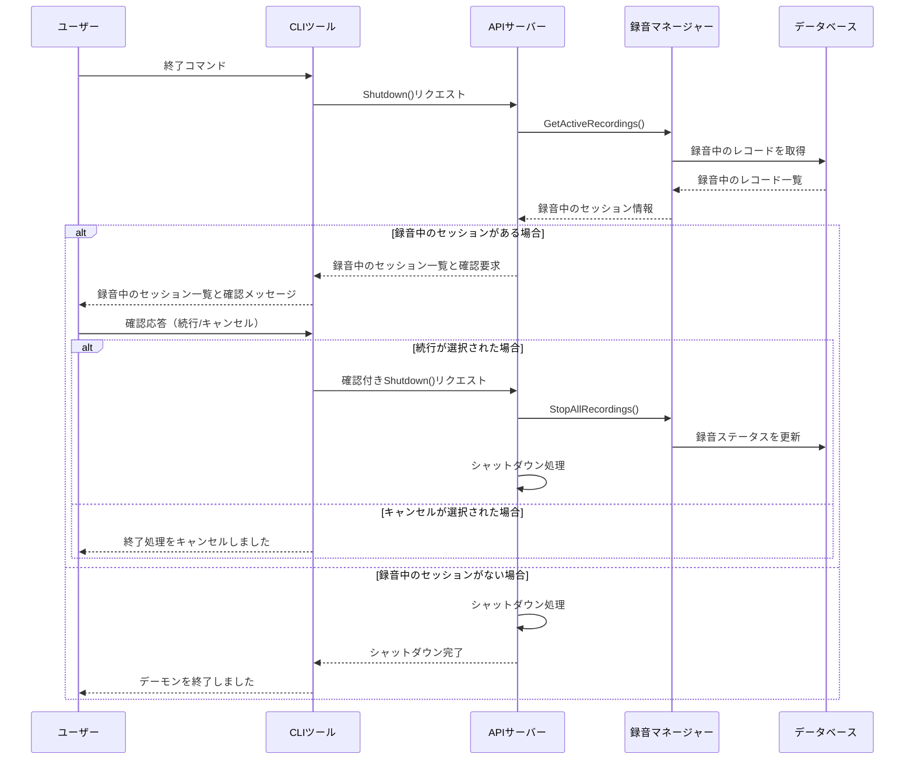
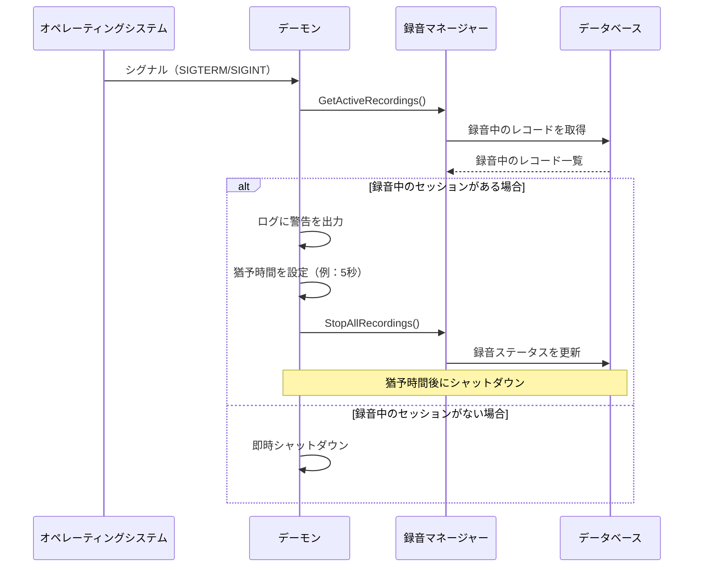

# デーモン終了時の録音処理の扱い

## 概要

Rec-adioのデーモン（コアサービス）が録音中に終了または再起動された場合の処理方法について検討します。ユーザーからの要件として、以下の方針が示されています：

1. 終了時に録音マネージャーを確認し、録音中であれば本当に終了するか確認する
2. 終了処理で録音中のものは適切に終了する

この文書では、この要件を実現するための具体的な実装方法を提案します。

## 現在の課題

現在の設計では、デーモンが終了すると以下の問題が発生します：

1. **録音プロセスの突然の終了**：
   - 録音中のプロセスが強制終了される
   - 出力ファイルが不完全な状態で残る
   - データベース上のステータスと実際の状態に不整合が生じる

2. **ユーザーへの通知不足**：
   - 録音中にデーモンを終了しようとした場合、警告や確認がない
   - 意図せず録音が中断される可能性がある

3. **再起動後の状態復元の欠如**：
   - 再起動後に以前の録音状態が適切に処理されない
   - 「録音中」のままのレコードが残る

## 提案される解決策

### 1. 終了時の確認プロセス

デーモン終了時に録音中のセッションがあるかどうかを確認し、ユーザーに適切な情報を提供します。

#### CLIからの終了コマンドの場合



#### シグナル（SIGTERM/SIGINTなど）の場合



### 2. 録音の適切な終了処理

録音中のセッションを適切に終了させるための処理を実装します。

```go
// StopAllRecordings は全ての録音セッションを停止します
func (rm *RecordingManager) StopAllRecordings(ctx context.Context) []error {
    rm.mu.Lock()
    sessions := make(map[string]RecordingSession, len(rm.recordSessions))
    for id, session := range rm.recordSessions {
        sessions[id] = session
    }
    rm.mu.Unlock()
    
    var errors []error
    
    // 各セッションを停止
    for id, session := range sessions {
        if err := session.Stop(ctx); err != nil {
            errors = append(errors, fmt.Errorf("録音 %s の停止に失敗しました: %w", id, err))
            continue
        }
        
        // レコードを更新
        var record models.Record
        if err := rm.db.First(&record, "id = ?", id).Error; err != nil {
            errors = append(errors, fmt.Errorf("録音レコード %s の取得に失敗しました: %w", id, err))
            continue
        }
        
        record.SetStatus(models.RecordStatusInterrupted)
        record.SetErrorMessage("デーモンのシャットダウンにより録音が中断されました")
        
        if err := rm.db.Save(&record).Error; err != nil {
            errors = append(errors, fmt.Errorf("録音レコード %s の更新に失敗しました: %w", id, err))
            continue
        }
        
        // イベント発行
        rm.emitEvent("recording.interrupted", map[string]interface{}{
            "record_id": id,
            "title":     record.Title,
            "platform":  record.Platform,
            "reason":    "daemon_shutdown",
        })
    }
    
    return errors
}
```

### 3. 再起動時の処理

デーモン起動時に、前回の実行で「録音中」のままになっているレコードを検出し、適切に処理します。

```go
// HandleOrphanedRecordings は前回の実行で録音中のままになっているレコードを処理します
func (rm *RecordingManager) HandleOrphanedRecordings(ctx context.Context) error {
    var records []models.Record
    if err := rm.db.Where("status = ?", models.RecordStatusRecording).Find(&records).Error; err != nil {
        return fmt.Errorf("録音中のレコードの検索に失敗しました: %w", err)
    }
    
    if len(records) == 0 {
        return nil
    }
    
    log.Printf("%d件の未完了の録音レコードを検出しました", len(records))
    
    for _, record := range records {
        record.SetStatus(models.RecordStatusInterrupted)
        record.SetErrorMessage("前回のデーモン実行時に録音が中断されました")
        
        if err := rm.db.Save(&record).Error; err != nil {
            log.Printf("録音レコード %s の更新に失敗しました: %v", record.ID, err)
            continue
        }
        
        // イベント発行
        rm.emitEvent("recording.interrupted", map[string]interface{}{
            "record_id": record.ID,
            "title":     record.Title,
            "platform":  record.Platform,
            "reason":    "previous_daemon_shutdown",
        })
    }
    
    return nil
}
```

## 実装案

### 1. 録音ステータスの拡張

録音の状態を表す列挙型に「中断」状態を追加します。

```go
// RecordStatus は録音の状態を表す列挙型です
type RecordStatus string

const (
    RecordStatusScheduled  RecordStatus = "scheduled"   // 予約済み
    RecordStatusRecording  RecordStatus = "recording"   // 録音中
    RecordStatusCompleted  RecordStatus = "completed"   // 完了
    RecordStatusFailed     RecordStatus = "failed"      // 失敗
    RecordStatusCanceled   RecordStatus = "canceled"    // キャンセル
    RecordStatusInterrupted RecordStatus = "interrupted" // 中断（デーモン終了などにより）
)
```

### 2. デーモンのシャットダウンハンドラー

デーモンのシャットダウン処理を拡張して、録音中のセッションを適切に処理します。

```go
// setupShutdownHandler はシャットダウンハンドラーを設定します
func setupShutdownHandler(ctx context.Context, cancel context.CancelFunc, recordingManager *RecordingManager) {
    sigCh := make(chan os.Signal, 1)
    signal.Notify(sigCh, syscall.SIGINT, syscall.SIGTERM)
    
    go func() {
        sig := <-sigCh
        log.Printf("シグナル %s を受信しました", sig)
        
        // 録音中のセッションを確認
        sessions, err := recordingManager.GetActiveRecordings(ctx)
        if err != nil {
            log.Printf("録音セッションの取得に失敗しました: %v", err)
        }
        
        if len(sessions) > 0 {
            log.Printf("録音中のセッションが %d 件あります。5秒後にシャットダウンします...", len(sessions))
            
            // 録音を停止
            errors := recordingManager.StopAllRecordings(ctx)
            for _, err := range errors {
                log.Printf("録音停止エラー: %v", err)
            }
            
            // 猶予時間を設ける
            time.Sleep(5 * time.Second)
        }
        
        // コンテキストをキャンセルしてシャットダウンを開始
        cancel()
    }()
}
```

### 3. CLIツールの拡張

CLIツールの終了コマンドを拡張して、録音中のセッションがある場合に確認を求めるようにします。

```go
// shutdownCommand はデーモンを終了するコマンドを定義します
var shutdownCommand = &cobra.Command{
    Use:   "shutdown",
    Short: "デーモンを終了します",
    Run: func(cmd *cobra.Command, args []string) {
        force, _ := cmd.Flags().GetBool("force")
        
        client := api.NewClient(cfg.App.API.URL, cfg.App.API.Key)
        
        if !force {
            // 録音中のセッションを確認
            sessions, err := client.GetActiveRecordings()
            if err != nil {
                fmt.Printf("録音セッションの取得に失敗しました: %v\n", err)
                os.Exit(1)
            }
            
            if len(sessions) > 0 {
                fmt.Printf("録音中のセッションが %d 件あります:\n", len(sessions))
                for i, session := range sessions {
                    fmt.Printf("%d. %s (%s)\n", i+1, session.Title, session.Platform)
                }
                
                fmt.Print("本当に終了しますか？ [y/N]: ")
                var response string
                fmt.Scanln(&response)
                
                if strings.ToLower(response) != "y" {
                    fmt.Println("終了をキャンセルしました")
                    return
                }
            }
        }
        
        // デーモンを終了
        if err := client.Shutdown(); err != nil {
            fmt.Printf("デーモンの終了に失敗しました: %v\n", err)
            os.Exit(1)
        }
        
        fmt.Println("デーモンを終了しました")
    },
}

func init() {
    shutdownCommand.Flags().BoolP("force", "f", false, "確認なしで強制的に終了します")
    rootCmd.AddCommand(shutdownCommand)
}
```

### 4. APIエンドポイントの実装

APIサーバーに、録音中のセッション一覧を取得するエンドポイントと、シャットダウンエンドポイントを実装します。

```go
// setupSystemRoutes はシステム関連のルートを設定します
func setupSystemRoutes(app *fiber.App, recordingManager *RecordingManager, cancel context.CancelFunc) {
    api := app.Group("/api")
    system := api.Group("/system")
    
    // システム状態取得エンドポイント
    system.Get("/status", func(c *fiber.Ctx) error {
        return c.JSON(fiber.Map{
            "status": "running",
            "uptime": time.Since(startTime).String(),
        })
    })
    
    // 録音中のセッション一覧取得エンドポイント
    system.Get("/recordings/active", func(c *fiber.Ctx) error {
        sessions, err := recordingManager.GetActiveRecordings(c.Context())
        if err != nil {
            return c.Status(fiber.StatusInternalServerError).JSON(fiber.Map{
                "error": err.Error(),
            })
        }
        
        return c.JSON(sessions)
    })
    
    // シャットダウンエンドポイント
    system.Post("/shutdown", func(c *fiber.Ctx) error {
        // 認証チェック（APIキーなど）
        // ...
        
        var req struct {
            Force bool `json:"force"`
        }
        
        if err := c.BodyParser(&req); err != nil {
            req.Force = false
        }
        
        if !req.Force {
            // 録音中のセッションを確認
            sessions, err := recordingManager.GetActiveRecordings(c.Context())
            if err != nil {
                return c.Status(fiber.StatusInternalServerError).JSON(fiber.Map{
                    "error": err.Error(),
                })
            }
            
            if len(sessions) > 0 {
                return c.JSON(fiber.Map{
                    "status": "confirm_required",
                    "message": "録音中のセッションがあります",
                    "active_recordings": sessions,
                })
            }
        }
        
        // 録音を停止
        errors := recordingManager.StopAllRecordings(c.Context())
        
        // シャットダウンを開始
        go func() {
            time.Sleep(1 * time.Second)
            cancel()
        }()
        
        return c.JSON(fiber.Map{
            "status": "shutting_down",
            "errors": errors,
        })
    })
}
```

### 5. デーモン起動時の処理

デーモン起動時に、前回の実行で録音中のままになっているレコードを処理します。

```go
// runDaemon はデーモンを実行します
func runDaemon() error {
    log.Println("Rec-adio Daemon を起動しています...")
    
    // コンテキストの作成
    ctx, cancel := context.WithCancel(context.Background())
    defer cancel()
    
    // データベース接続
    db, err := gorm.Open(sqlite.Open(cfg.Database.Path), &gorm.Config{})
    if err != nil {
        return fmt.Errorf("データベースへの接続に失敗しました: %w", err)
    }
    
    // イベントエミッターを作成
    eventEmitter := event.NewEventEmitter()
    
    // 録音マネージャーを作成
    recordingManager := recording.NewRecordingManager(db, eventEmitter, cfg)
    
    // レコーダープラグインを登録
    // ...
    
    // 前回の実行で録音中のままになっているレコードを処理
    if err := recordingManager.HandleOrphanedRecordings(ctx); err != nil {
        log.Printf("未完了の録音レコードの処理に失敗しました: %v", err)
    }
    
    // シャットダウンハンドラーを設定
    setupShutdownHandler(ctx, cancel, recordingManager)
    
    // APIサーバーを起動
    app := fiber.New()
    setupRoutes(app, recordingManager, cancel)
    
    // 以下、既存のコード
    // ...
    
    return nil
}
```

## 考慮事項

### 1. 録音データの扱い

デーモン終了時に録音が中断された場合、録音データの扱いについて以下の選択肢があります：

1. **そのまま保存**：
   - 中断された時点までの録音データをそのまま保存
   - ファイル名やメタデータに「中断」の旨を記録

2. **削除**：
   - 中断された録音データを削除
   - ディスク容量を節約できるが、部分的なデータも失われる

3. **ユーザー設定**：
   - 設定ファイルでユーザーが選択できるようにする
   - デフォルトは「そのまま保存」

推奨は「そのまま保存」とし、ファイル名に「_interrupted」などの接尾辞を追加することで、中断されたファイルであることを明示します。

### 2. 再起動後の録音再開

デーモンが再起動された場合、中断された録音を再開するかどうかについても検討が必要です：

1. **再開しない**：
   - シンプルな実装
   - ユーザーが明示的に再開する必要がある

2. **自動再開**：
   - 複雑な実装
   - ストリーミングの場合、再接続が必要
   - 時間が経過している場合の扱いが難しい

現時点では「再開しない」アプローチを採用し、将来的な拡張として「自動再開」機能を検討することを推奨します。

### 3. 通知

録音が中断された場合、ユーザーに通知することも重要です：

1. **イベント発行**：
   - `recording.interrupted` イベントを発行
   - 通知プラグインを通じてユーザーに通知

2. **ログ記録**：
   - 詳細なログを記録
   - 中断の理由や時刻を含める

3. **UIでの表示**：
   - 将来的なGUI実装では、中断された録音を特別に表示

### 4. セキュリティ

シャットダウンAPIは特権操作であるため、適切な認証・認可が必要です：

1. **APIキー認証**：
   - シャットダウンAPIへのアクセスには有効なAPIキーが必要

2. **ローカルバインディング**：
   - APIサーバーをローカルホスト（127.0.0.1）にのみバインド
   - リモートからのアクセスを制限

3. **ログ記録**：
   - シャットダウン操作のログを記録
   - 誰が、いつ、どのような理由でシャットダウンしたかを追跡

## まとめ

デーモン終了時の録音処理の扱いについて、以下の方針で実装を進めます：

1. **終了時の確認**：
   - CLIからの終了コマンドの場合は、ユーザーに確認を求める
   - シグナルの場合は、ログに警告を出力し、猶予時間を設ける

2. **録音の適切な終了**：
   - 録音中のセッションを適切に停止
   - 録音ステータスを「中断」に更新
   - イベントを発行して通知

3. **再起動時の処理**：
   - 前回の実行で録音中のままになっているレコードを検出
   - これらのレコードを「中断」状態に更新

4. **データの扱い**：
   - 中断された録音データはそのまま保存
   - ファイル名やメタデータに「中断」の旨を記録

この実装により、デーモンの終了・再起動時にも録音データの整合性を維持し、ユーザー体験を向上させることができます。
